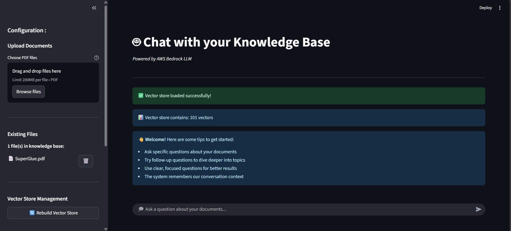

# Retrieval-Augmented Generation (RAG) QA App

A Retrieval-Augmented Generation (RAG) application enabling natural conversational interaction with your knowledge base by combining advanced AI language models and efficient vector search.

Built with **LangChain**, **FAISS**, **AWS Bedrock**, and **Streamlit**, this app retrieves relevant context from your documents using vector similarity search, maintains conversational state with memory and generates intelligent responses using state-of-the-art LLMs.

---

## Features & Tech Stack

- 🔎 Context-aware question answering over your documents using **FAISS** for efficient vector similarity search  
- 💾 Conversational memory for multi-turn dialogue 
- 🤖 Large language model inference powered by **AWS Bedrock** for scalable AI responses  
- 💬 Interactive, user-friendly interface built with **Streamlit**  
- 🛠️ Modular and extensible pipeline orchestrated using **LangChain**  
- ⚙️ Developed in **Python** with environment management via **Conda**

---

## ⚙️ Prerequisites

- Python 3.10+  
- [Conda](https://docs.conda.io/en/latest/miniconda.html) (Miniconda or Anaconda)  
- [AWS CLI](https://docs.aws.amazon.com/cli/latest/userguide/install-cliv2.html), configured with credentials  
- Access to [AWS Bedrock](https://aws.amazon.com/bedrock/) with an appropriate model enabled

---

## 📦 Installation

- Clone the repository
- Create and activate a Conda environment
- Install dependencies
    ``` 
        pip install -r requirements.txt
    ```
- Run the app
    ```
        streamlit run app4.py
    ```

---




